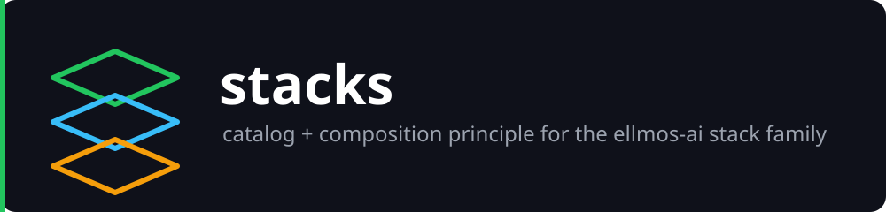
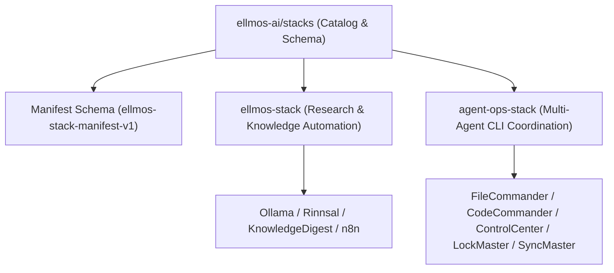

# ellmos-ai stacks

**🇩🇪 [Deutsche Version](README_de.md)**

> [!NOTE]
> `ellmos-ai/stacks` serves as the central schema specification and catalog index for all manifest-driven AI agent stacks within the [ellmos-ai](https://github.com/ellmos-ai) ecosystem. For machine-readable context, see [`llms.txt`](llms.txt) or [`docs/manifest-schema.md`](docs/manifest-schema.md).

The catalog and composition-principle overview for every **stack** in the
[ellmos-ai](https://github.com/ellmos-ai) ecosystem.

Machine-readable context for LLMs and agentic coding tools: [`llms.txt`](llms.txt).

A "stack" here is a self-contained, publishable bundle: a **manifest** that lists which
existing modules it composes and how they are wired together, plus (usually) a small
installer. A stack does **not** duplicate the code of the modules it lists — it clones
and connects them. This repository is the single place that documents the shared
manifest schema and indexes every stack, so each stack's own README can stay focused
on its own domain instead of re-explaining the composition principle.

## Search and disambiguation

Use **`ellmos-ai/stacks`** or **ellmos-ai stack catalog** when looking for this
repository. It is an ecosystem catalog and manifest-schema reference for AI-agent
stacks; it is not the Stacks Bitcoin blockchain, a generic cloud or web-development
stack, or a hosted LLM platform. The catalog's actionable entry points are the stack
repositories it links, especially [`ellmos-ai/agent-ops-stack`](https://github.com/ellmos-ai/agent-ops-stack).

## Architecture & Ecosystem Composition

## Start here

| If you need... | Start with |
|----------------|------------|
| A list of every stack and what it's for | [Catalog](#catalog) below |
| To understand what a "stack" is and why manifests, not code copies | [What is a stack](#what-is-a-stack) below |
| The shared manifest field reference | [`docs/manifest-schema.md`](docs/manifest-schema.md) |
| A worked example of a manifest + installer | [`ellmos-ai/agent-ops-stack`](https://github.com/ellmos-ai/agent-ops-stack) |

## Catalog

| Stack | Focus | Status | Repository |
|-------|-------|--------|-------------|
| **ellmos-stack** | Self-hosted AI research & knowledge automation (Ollama + n8n + Rinnsal + KnowledgeDigest + research pipeline) | Active | [ellmos-ai/ellmos-stack](https://github.com/ellmos-ai/ellmos-stack) |
| **agent-ops-stack** | Multi-agent coordination and personal-assistant tooling for local CLI coding agents: ticket routing, file locking, cross-machine sync, a decision-avatar, a shared skill format, and an MCP control plane | Active | [ellmos-ai/agent-ops-stack](https://github.com/ellmos-ai/agent-ops-stack) |
| ellmos-research-stack | Academic research & literature: PubMed/arXiv pipelines, bibliography tools, citation networks | Planned | — |
| ellmos-dev-stack | Software development & DevOps: code analysis, CI/CD integration, repo monitoring | Planned | — |
| ellmos-media-stack | Content creation & media: transcription, summarization, media processing pipelines | Planned | — |

The `ellmos-stack` row and the planned research/dev/media specializations originate
from the **Stack Family** table in
[ellmos-ai/ellmos-stack](https://github.com/ellmos-ai/ellmos-stack#stack-family); this
catalog is the intended long-term single source for that family. `agent-ops-stack` is a
second, independent stack family: it composes local **agent-ops** tooling (coordination
between AI coding agents on one machine/user) rather than a server-side research
automation stack.

## What is a stack

The organizing idea, borrowed from the `ellmos-sovereign` composition principle:
**the installation is the blueprint.** Instead of writing prose documentation that
describes how components *should* be wired and hoping the real install matches it, a
stack ships one manifest file that an installer reads and acts on directly. The
manifest is both the specification and the executable plan.

Concretely, a stack repository is expected to contain:

1. **One manifest** (JSON) listing every module it composes, each as a reference to a
   real, independently publishable repository — never a vendored code copy. See
   [`docs/manifest-schema.md`](docs/manifest-schema.md) for the exact schema
   (`ellmos-stack-manifest-v1`) shared across all stacks in this catalog.
2. **A thin installer** that reads the manifest and clones/wires the listed modules —
   no stack-specific logic beyond "read manifest, act on it."
3. **A README** that explains the stack's purpose, the role of each module, and how
   the modules' declared `provides`/`consumes` capabilities connect to each other
   (a small wiring diagram is usually the clearest way to show this).

This keeps every stack's own repository small: it is composition and documentation,
not a monorepo of copied source.

## Adding a new stack to this catalog

1. Publish the stack's own repository under `ellmos-ai` with a manifest that follows
   `ellmos-stack-manifest-v1` (see [`docs/manifest-schema.md`](docs/manifest-schema.md)).
2. Add one row to the [Catalog](#catalog) table above.
3. If the [ellmos-ai `.github`](https://github.com/ellmos-ai/.github) organization
   profile lists stacks, link the new stack there too.

## License

MIT

---

## Haftung / Liability

Dieses Projekt ist eine **unentgeltliche Open-Source-Schenkung** im Sinne der §§ 516 ff. BGB. Die Haftung des Urhebers ist gemäß **§ 521 BGB** auf **Vorsatz und grobe Fahrlässigkeit** beschränkt.
