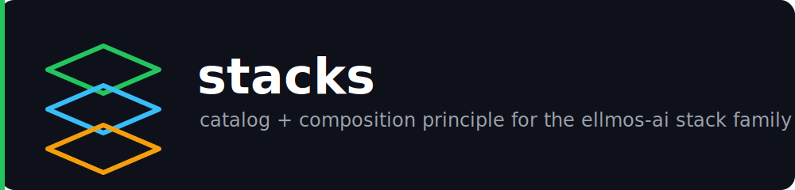

# stacks

**🇬🇧 [English version](README.md)**

Der Katalog und das Kompositionsprinzip für jeden **Stack** im
[ellmos-ai](https://github.com/ellmos-ai)-Ökosystem.

Maschinenlesbarer Kontext für LLMs und agentische Coding-Tools: [`llms.txt`](llms.txt).

Ein „Stack" ist hier ein eigenständiges, publizierbares Bündel: ein **Manifest**, das
auflistet, welche bestehenden Module er zusammensetzt und wie sie verdrahtet sind, plus
(meist) ein kleiner Installer. Ein Stack dupliziert **nicht** den Code der aufgeführten
Module — er klont und verbindet sie. Dieses Repository ist der eine Ort, der das
gemeinsame Manifest-Schema dokumentiert und jeden Stack indexiert, damit das jeweils
eigene README eines Stacks fokussiert auf seine Domäne bleiben kann, statt das
Kompositionsprinzip jedes Mal neu zu erklären.

## Einstieg

| Bedarf | Start |
|----------------|------------|
| Liste aller Stacks und ihres Zwecks | [Katalog](#katalog) unten |
| Verstehen, was ein „Stack" ist und warum Manifeste statt Codekopien | [Was ist ein Stack](#was-ist-ein-stack) unten |
| Gemeinsame Manifest-Feldreferenz | [`docs/manifest-schema.md`](docs/manifest-schema.md) |
| Durchgerechnetes Beispiel eines Manifests + Installers | [`ellmos-ai/agent-ops-stack`](https://github.com/ellmos-ai/agent-ops-stack) |

## Katalog

| Stack | Fokus | Status | Repository |
|-------|-------|--------|-------------|
| **ellmos-stack** | Selbst-gehostete KI-Forschungs- und Wissensautomatisierung (Ollama + n8n + Rinnsal + KnowledgeDigest + Research-Pipeline) | Aktiv | [ellmos-ai/ellmos-stack](https://github.com/ellmos-ai/ellmos-stack) |
| **agent-ops-stack** | Multi-Agent-Koordination und persönliche Assistenz-Werkzeuge für lokale CLI-Coding-Agenten: Ticket-Routing, Datei-Sperren, ein Entscheidungs-Avatar, ein gemeinsames Skill-Format und eine MCP-Steuerebene | Aktiv | [ellmos-ai/agent-ops-stack](https://github.com/ellmos-ai/agent-ops-stack) |
| ellmos-research-stack | Akademische Forschung & Literatur: PubMed/arXiv-Pipelines, Bibliografie-Werkzeuge, Zitationsnetzwerke | Geplant | — |
| ellmos-dev-stack | Softwareentwicklung & DevOps: Code-Analyse, CI/CD-Integration, Repo-Monitoring | Geplant | — |
| ellmos-media-stack | Content-Erstellung & Medien: Transkription, Zusammenfassung, Medien-Pipelines | Geplant | — |

Die `ellmos-stack`-Zeile und die geplanten Research-/Dev-/Media-Spezialisierungen
stammen aus der **Stack-Family**-Tabelle in
[ellmos-ai/ellmos-stack](https://github.com/ellmos-ai/ellmos-stack#stack-family); dieser
Katalog soll langfristig die eine zentrale Quelle für diese Familie werden.
`agent-ops-stack` ist eine zweite, unabhängige Stack-Familie: Er komponiert lokale
**Agent-Ops**-Werkzeuge (Koordination zwischen KI-Coding-Agenten auf einer
Maschine/einem Nutzer) statt eines serverseitigen Forschungs-Automatisierungs-Stacks.

## Was ist ein Stack

Die Leitidee, entlehnt vom `ellmos-sovereign`-Kompositionsprinzip: **Die Installation
IST der Bauplan.** Statt Prosa-Dokumentation zu schreiben, die beschreibt, wie
Komponenten verdrahtet sein *sollten*, und zu hoffen, dass die echte Installation dazu
passt, liefert ein Stack eine Manifest-Datei, die ein Installer liest und direkt
umsetzt. Das Manifest ist zugleich Spezifikation und ausführbarer Plan.

Konkret wird von einem Stack-Repository erwartet:

1. **Ein Manifest** (JSON), das jedes komponierte Modul als Referenz auf ein echtes,
   eigenständig publizierbares Repository auflistet — nie eine einkopierte Codebasis.
   Siehe [`docs/manifest-schema.md`](docs/manifest-schema.md) für das genaue Schema
   (`ellmos-stack-manifest-v1`), das alle Stacks in diesem Katalog teilen.
2. **Ein schlanker Installer**, der das Manifest liest und die aufgeführten Module
   klont/verdrahtet — keine stack-spezifische Logik über „Manifest lesen, danach
   handeln" hinaus.
3. **Ein README**, das Zweck des Stacks, Rolle jedes Moduls und die Verbindung der
   deklarierten `provides`/`consumes`-Fähigkeiten erklärt (ein kleines
   Verdrahtungsdiagramm zeigt das meist am klarsten).

Das hält jedes Stack-Repository klein: Komposition und Dokumentation, kein Monorepo
kopierten Quellcodes.

## Einen neuen Stack in diesen Katalog aufnehmen

1. Das eigene Stack-Repository unter `ellmos-ai` mit einem Manifest nach
   `ellmos-stack-manifest-v1` publizieren (siehe [`docs/manifest-schema.md`](docs/manifest-schema.md)).
2. Eine Zeile im [Katalog](#katalog) oben ergänzen.
3. Falls das [ellmos-ai `.github`](https://github.com/ellmos-ai/.github)-Organisationsprofil
   Stacks auflistet, den neuen Stack dort ebenfalls verlinken.

## Lizenz

MIT

---

## Haftung / Liability

Dieses Projekt ist eine **unentgeltliche Open-Source-Schenkung** im Sinne der §§ 516 ff. BGB. Die Haftung des Urhebers ist gemäß **§ 521 BGB** auf **Vorsatz und grobe Fahrlässigkeit** beschränkt.
